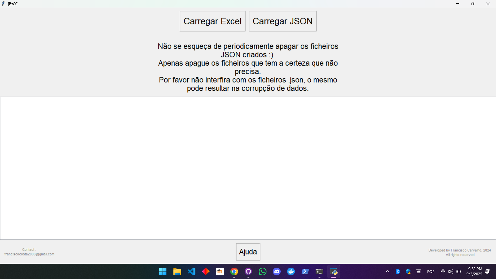
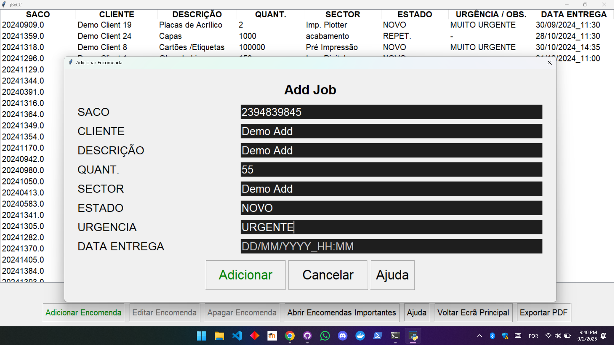
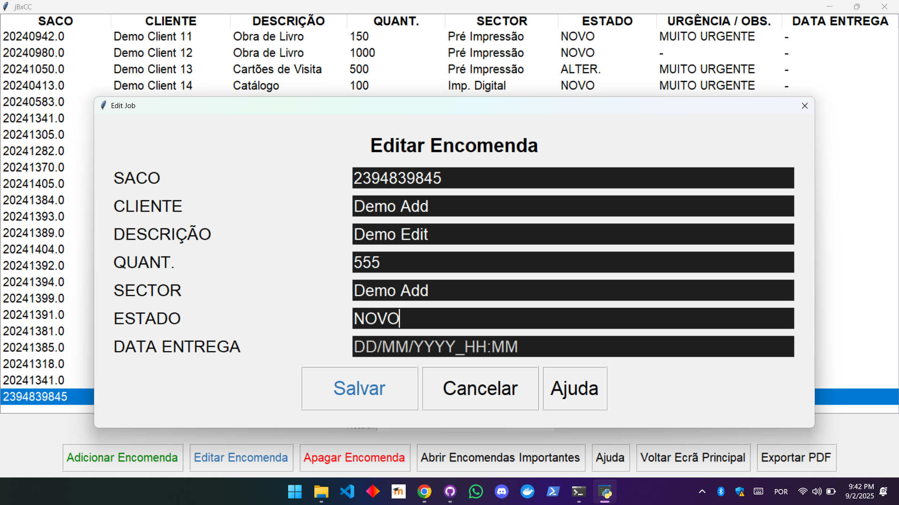
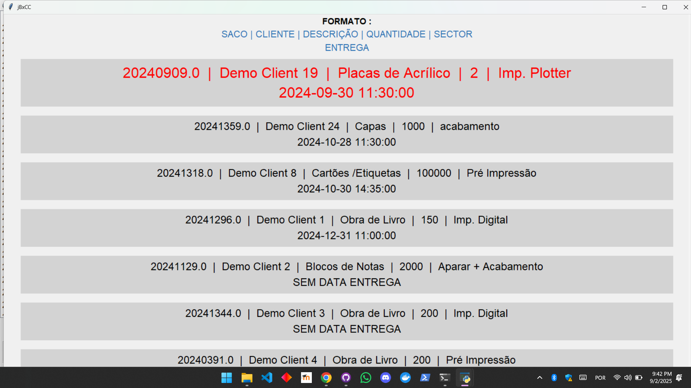

# 🗂️ TBA — Workflow & Order Management App

A desktop application developed for **Tipografia Beira Alta, Lda** to **digitize order/workflow tracking** and reduce paper dependency.  
Built with **Python**, **Tkinter** (UI), and **pandas** for data handling.  

This repo includes **synthetic demo data** in [`DemoData/`](DemoData) so you can try the app safely. 

The repo also includes demo screenshots of the app running. You can find these in the [`Screenshots`](#Screenshots) section of this README, and in the [`Screenshots/`](Screenshots) folder.

No company information is included.

---

## ✨ Features

- 📋 **Order management** with a Tkinter-based UI  
- 🔎 **Add**, **edit**, **delete**, and **mark** jobs as important  
- 💾 **State saving** to JSON (resume where you left off)  
- 📊 **Excel-based data import** (must respect predefined structure), with the **option to import from an existing JSON** state file  
- 🖨️ **Export to PDF** with neat, coherent formatting (via ReportLab)  
- 📐 Screen-aware sizing (tested on Windows 1080p; some scaling issues on MacBook screens)  
- 🔁 Iterative design with helper windows and dialogs  

---

## 🚀 Quick Start

### 1) Requirements
- Python 3.10+  
- OS: Windows (1080p recommended) or macOS  

### 2) Clone the repo
```bash
git clone https://github.com/Xicocc/TBA.git
cd TBA
```

### 3) Installing dependencies (if needed)
If you are unsure of what you need to run this application, please check the [`Dependencies`](#dependencies) section of this README file.

To install the dependencies you have two options:

#### 🔹 Option 1 — Virtual environment (recommended)

This creates a project-specific sandbox so versions never conflict.

##### macOS / Linux (Application not tested on Linux)
```bash
python3 -m venv .venv
source .venv/bin/activate
pip install -r requirements.txt
```

##### Windows (PowerShell)
```bash
python -m venv .venv
.\.venv\Scripts\Activate.ps1
pip install -r requirements.txt
```

Deactivate the environment at any time with:
```bash
deactivate
```

#### 🔹 Option 2 — Global install (simpler, but less safe)

If you prefer, you can install dependencies system-wide:
```bash
pip install -r requirements.txt
```

⚠️ Note: this may cause version conflicts if other projects on your system need different library versions.

### 4) Run the app

##### macOS / Linux (Application not tested on Linux)
```bash
python3 current/main.py
```

##### Windows (PowerShell)
```bash
python current/main.py
```

## 🧪 Demo Data

The folder [`DemoData/`](DemoData) contains synthetic examples for testing:

- Excel sheet — structured input required for the app to work.

- JSON file — app state file (saved when closing, if user chooses).

- PDF file — exported directly from the app, ready to print/distribute.

When using your own Excel, make sure to match the column structure of the demo file.

<a id="Screenshots"></a>
## 📸 Screenshots

| **Home window** | **Main window** |
|:---------------:|:---------------:|
|  |  |
| **Add job window** | **Edit job window** |
|  |  |
| **Important jobs window** | **Pdf export** |
|  |  |

<a id="dependencies"></a>
## ⚙️ Dependencies

The app depends on:

- **tkinter** — UI framework (bundled with Python)

- **pandas** — Excel/CSV parsing and data handling

- **screeninfo** — detect monitor resolution

- **reportlab** — PDF generation (tables, styles, exports)

- **Standard library**: json, datetime, logging, locale, os, sys

- **Local modules** (inside current/):

    - constants.py

    - date_placeholder.py

    - help_window.py

    - json_operations.py

    - add_job_form.py

    - edit_job_form.py

    - delete_job_form.py

    - important_jobs_view.py

Dependencies are listed in [`requirements.txt`](requirements.txt)

## 📂 Project Structure
```bash
TBA/
├─ current/
│  ├─ main.py                # entry point (run this)
│  ├─ constants.py
│  ├─ json_operations.py
│  ├─ add_job_form.py
│  ├─ edit_job_form.py
│  ├─ delete_job_form.py
│  ├─ important_jobs_view.py
│  ├─ help_window.py
│  ├─ date_placeholder.py
│  ├─ logo_tba.png            # the logo of the company this app was developed for
│  └─ notebook-line-icon.ico  # an icon to build the app with
├─ DemoData/
├─ screenshots/
├─ requirements.txt
├─ .gitattributes
├─ .gitignore
└─ README.md
```

## 🧱 Tech Stack

- Python 3.10+

- Tkinter for GUI

- pandas for data analysis

- reportlab for PDF exports

- screeninfo for monitor handling

## 🔒 Data & Privacy

- All data in this repository is synthetic and safe to share

- No company information is included

- Excel structure must be respected for the app to run correctly

## ⚠️ Known Issues
- Some scaling issues on macOS Retina (2560x1600)

- Designed primarily for Windows at 1080p resolution

- Buttons may appear invisible when data is first loaded on macOS (refreshes after any user action)


## 📜 License
This project is provided for **portfolio and demonstration purposes**.  

You are welcome to clone, run, and test it, but **commercial or professional use is not authorized** without explicit permission.  

© All rights reserved to the developer.
